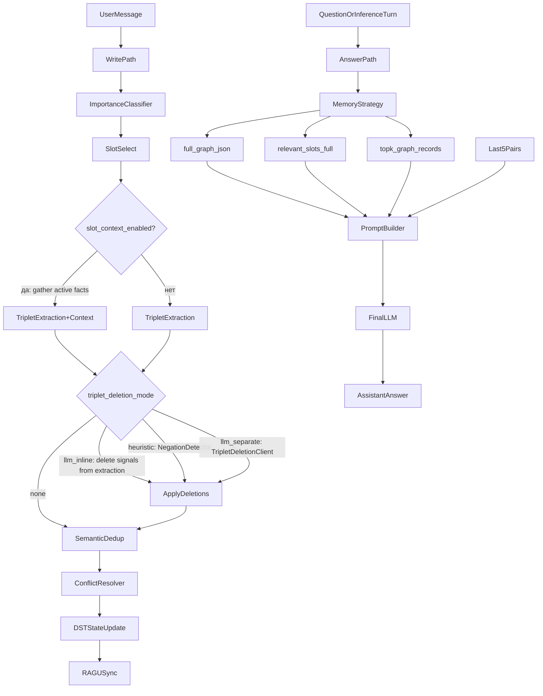

# PIPELINE: полная техническая документация

Этот документ описывает полную техническую картину `DST_memory`: архитектуру, жизненный цикл данных, режимы запуска, форматы, ограничения и практические сценарии.

---

## 1. Назначение

`DST_memory` реализует долговременную память для LLM в виде структурированного графа фактов.

Цели:
- записывать только значимую пользовательскую информацию;
- поддерживать обновление/деактивацию конфликтующих фактов;
- **удалять устаревшие факты** при явном отказе пользователя (новые режимы);
- управлять временем жизни (TTL) каждого факта и автоматически «протухать» устаревшие записи;
- дедуплицировать семантически близкие факты в рамках одного слота;
- извлекать релевантный memory context для ответа;
- передавать memory context в final LLM в контролируемом формате с полными промптами в логах.

---

## 2. Высокоуровневая схема



---

## 3. Модульная структура

```
dst_memory/
├── __init__.py          — экспорт PipelineConfig, Message, MemoryFact
├── core/                — ядро пайплайна
│   ├── pipeline.py      — DSTMemoryPipeline (write/answer/clear)
│   ├── dst_manager.py   — DSTManager: слоты, TTL, конфликты, дедуп, RAGU-sync
│   ├── models.py        — Message, FactRecord, MemoryFact, DialogueMemoryState
│   ├── config.py        — PipelineConfig, SLOT_DEFAULT_TTL
│   └── graph_backend.py — GraphEdge (dataclass)
├── prompts/             — сборщики промптов и few-shot банки по языку UI
│   ├── loader.py , parsers.py — выбор `ru`/`en`, общие JSON-парсеры ответов LLM
│   ├── ru/              — русскоязычные тексты (system/user, few-shots)
│   └── en/              — English UI (тот же формат JSON; триплеты в графе — русские леммы)
├── slots/               — слоты и онтология
│   ├── ontology.py             — SlotOntology, DEFAULT_USER_SLOTS, метки RU
│   ├── slot_name_normalize.py  — нормализация имён слотов
│   ├── slot_model_path.py      — разрешение путей к модели слотов
│   ├── slot_select_client.py   — SlotSelectClient (выбор слота из онтологии)
│   └── slot_update_client.py   — SlotUpdateClient (add/update/delete записей)
├── triplets/            — извлечение и управление триплетами
│   ├── triplet_client.py       — TripletExtractionClient
│   ├── conflict_client.py      — TripletConflictClient (rule + LLM)
│   ├── deletion_client.py      — TripletDeletionClient (llm_separate режим)
│   └── negation_detector.py    — NegationDeletionDetector (heuristic режим)
├── storage/             — RAGU backend
│   └── ragu_graph_processor.py — RaguGraphProcessor, build_ragu_processor
├── clients/             — LLM-клиенты и serving
│   ├── serving.py              — LocalHFServing (HF CausalLM)
│   ├── classifier.py           — ImportanceClassifier
│   ├── memory_gate_client.py   — MemoryGateClient
│   └── llm_client.py           — FinalLLMClient
└── utils/               — вспомогательные утилиты
    ├── io_utils.py             — read_jsonl, iter_user_messages, iter_dialogue_messages
    ├── dotenv_loader.py        — загрузка .env
    └── run_config_loader.py    — загрузка run_config.json
```

### 3.1 Entry-point

- `run.py`
  - парсинг CLI;
  - загрузка конфига (`run_config.json` + `.env`);
  - bootstrap RAGU-пути (`_ensure_local_ragu_import`);
  - сборка `DSTMemoryPipeline`;
  - выполнение `module`/`pipeline` команд.

### 3.2 Core pipeline

- `dst_memory/core/pipeline.py`
  - запись в память (`write_to_memory`);
  - формирование memory context (`_memory_context_for_question`);
  - генерация ответа (`answer`);
  - диагностический режим без final LLM (`answer_without_final_llm`);
  - окно последних пар (`add_recent_pair`, `recent_pairs`).

### 3.3 DST state manager

- `dst_memory/core/dst_manager.py`
  - хранит `DialogueMemoryState`;
  - записывает факты в слоты;
  - **семантическая дедупликация** (pre-pass, threshold 0.9): при обнаружении семантически близкого факта в том же слоте старый деактивируется, новый вставляется;
  - конфликт-резолвинг (rule-based + LLM);
  - **TTL expiry**: ленивая проверка `is_active=False` при каждом чтении/записи;
  - синхронизация вставок/удалений в RAGU;
  - выдача active slots, expired facts и slot payload.

### 3.4 Модели и форматы

- `dst_memory/core/models.py`
  - `Message`
  - `FactRecord` — включает `ttl: str` и `created_at_datetime: str` (ISO); метод `is_expired()` для ленивой проверки
  - `MemoryFact`
  - `DialogueMemoryState`:
    - `step`
    - `slots`
    - `next_record_id`
    - `recent_pairs` (последние `user/assistant` пары)

### 3.5 LLM-компоненты

- `dst_memory/clients/classifier.py` — importance classifier.
- `dst_memory/slots/slot_select_client.py` — выбор слотов.
- `dst_memory/triplets/triplet_client.py` — извлечение триплетов.
- `dst_memory/triplets/conflict_client.py` — LLM-конфликт-резолвер.
- `dst_memory/clients/memory_gate_client.py` — выбор релевантных слотов для ответа.
- `dst_memory/clients/llm_client.py` — финальная генерация ответа.

### 3.6 RAGU интеграция

- `dst_memory/storage/ragu_graph_processor.py`
  - адаптер `SentenceTransformerEmbedder`;
  - мост sync/async;
  - upsert/delete triplets;
  - semantic search через `LocalSearchEngine`.

---

## 4. Write-path (запись сообщения в память)

Функция: `DSTMemoryPipeline.write_to_memory(dialogue_id, Message(role="user", ...))`

Шаги:
1. Проверка роли: записываются только `user`-сообщения.
2. Importance classifier:
   - если сообщение неважное → `saved=False, reason=not_important`.
3. Slot selection (`SlotSelectClient`):
   - выбираются целевые слоты по онтологии.
4. TTL expiry pre-pass:
   - все факты в затронутых слотах проверяются на `is_expired()`; протухшие деактивируются (`is_active=False`) и синхронизируются в RAGU.
5. Triplet extraction (`TripletExtractionClient`):
   - извлекаются триплеты по слотам (lowercase/русский язык);
   - в режиме `ttl_mode=mode2` модель дополнительно генерирует поле `ttl` для каждого триплета.
6. Семантическая дедупликация (pre-pass, только в рамках одного слота):
   - для каждого нового триплета вычисляется косинусное сходство с активными записями слота;
   - если сходство ≥ `ttl_semantic_dedup_threshold` (default 0.9), старый факт деактивируется, новый вставляется (таймер TTL обновляется).
7. Conflict resolution (`TripletConflictClient`):
   - rule-layer + LLM-layer;
   - возможна деактивация старых записей и/или skip новых;
   - `skip_new` в ответе LLM является опциональным: парсер корректно обрабатывает ответы только вида `{"deactivate":[...]}`.
8. Обновление DST state:
   - добавляются `FactRecord` с полями `ttl` и `created_at_datetime`;
   - обновляется `step`, `record_id`.
9. RAGU sync:
   - новые записи → `upsert_triplet_deltas` (TTL хранится в поле `description` ребра);
   - деактивации → `delete_triplet_deltas`.

---

## 5. Answer-path (формирование context и ответ)

Функция: `DSTMemoryPipeline.answer(dialogue_id, question)`

1. Выбор стратегии memory context.
2. Сбор context payload.
3. Добавление последних `recent_pairs`.
4. Передача в `FinalLLMClient.generate(...)`.

### 5.1 Стратегия `full_graph_json`

В final LLM идет полный JSON активной памяти:

```json
{
  "dialogue_id": "d1",
  "slots": [
    {
      "slot": "FAMILY",
      "messages": [
        {
          "record_id": 1,
          "message_text": "...",
          "source_text": "...",
          "subject": "...",
          "relation": "...",
          "object": "...",
          "created_at_step": 1,
          "updated_at_step": 1,
          "is_active": true,
          "ttl": "inf",
          "created_at_datetime": "2025-01-01T12:00:00"
        }
      ]
    }
  ]
}
```

### 5.2 Стратегия `relevant_slots_full`

1. Берутся active slots.
2. `MemoryGateClient` решает `use_memory` и выбирает слоты.
3. В context идет полное содержимое выбранных слотов.
4. Если `disable_memory_gate=true`, берутся все active slots.

### 5.3 Стратегия `topk_graph_records`

1. Вопрос -> RAGU semantic search по всему графу.
2. Берется top-k (`graph_top_k_records`, default 20).
3. В context идет список наиболее релевантных графовых строк.

---

## 6. Последние 5 пар user/assistant

Хранятся в `DialogueMemoryState.recent_pairs`.

Поток:
- В `test` режиме пары восстанавливаются из входного диалога (`iter_dialogue_messages`).
- В `inference` режиме пара добавляется после получения финального ответа.

Формат:

```json
[
  {"user": "....", "assistant": "...."},
  {"user": "....", "assistant": "...."}
]
```

---

## 7. Режимы запуска

## 7.1 `pipeline test`

Назначение: offline-прогон датасета.

Логика:
- все user-реплики пишутся в память;
- пары user/assistant попадают в `recent_pairs`;
- финальный вопрос задается один раз;
- сохраняются:
  - compact output,
  - подробные логи.

Команда:

```bash
python DST_memory/run.py pipeline test --dataset-path data/format_example.jsonl --output-path DST_memory/output.json
```

## 7.2 `pipeline inference interactive`

Назначение: онлайн-диалог.

Логика на шаг:
- user message → `write_to_memory`;
- ответ → `answer`;
- пара добавляется в `recent_pairs`.

Команды:
- `/clear` — сбросить память текущего диалога
- `/exit` — завершить сессию
- `/memory` — вывести активные слоты и факты в JSON
- `/expired` — вывести протухшие факты (is_active=False) в JSON

## 7.3 `pipeline inference single-turn`

Назначение: API-friendly single request.

Логика:
- одно сообщение записывается;
- сразу один ответ;
- возвращается json с write_log + answer.

---

## 8. RAGU: хранение и релевантность

### 8.1 Как сохраняются данные в RAGU

Для каждого триплета:
- `Entity(subject, entity_type=slot)`
- `Entity(object, entity_type=slot)`
- `Relation(subject → object, relation_type, slot)`

TTL хранится в поле `description` ребра в виде аннотации `[ttl:Xm]`, например:
```
пользователь есть сестра сестра пользователя [ttl:inf]
```

`record_id` хранится в mapping для последующего delete.

### 8.2 Где хранится

- Персистентные файлы RAGU в `ragu_storage` (или `ragu_storage_path`).
- Внешняя серверная БД (Postgres/Qdrant/Milvus) в текущем проекте не используется.

### 8.3 Как считается релевантность

- Semantic ranking `LocalSearchEngine.a_search(query, top_k)`.
- Для `relevant_slots_full` дополнительно действует slot-filter через gate.

---

## 9. Final LLM prompt

`FinalLLMClient` получает:
- `question`
- `memory_context` (структурный JSON/records)
- `recent_pairs`

Язык system/user текстов финальной LLM совпадает с `prompt_language` (`ru` \| `en`): шаблоны в `dst_memory/prompts/ru/final_llm_messages.py` и `dst_memory/prompts/en/final_llm_messages.py` (префикс политики API без инструментов — одноязычный внутри выбранной локали). Константа `CHAT_API_OUTPUT_POLICY` в `llm_client.py` остаётся двуязычной только для **judge**-вызовов в скриптах валидации.

В `openrouter/api` режиме отправляется OpenAI-compatible `chat/completions`.

### Поддерживаемые режимы final LLM

- `stub` — локальный шаблонный ответ.
- `openrouter` — основной runtime режим.
- `api` — OpenAI-compatible endpoint.
- `puter` — OpenAI-compatible endpoint Puter (`https://api.puter.com/puterai/openai/v1`).
- `local` — локальная HF-модель через `LocalHFServing` (поддерживаются `llm_load_dtype`, `llm_load_quantization`, `llm_max_context_tokens`).

---

## 10. Форматы выходов

### 10.1 `answer_without_final_llm`

Возвращает:
- `dialogue_id`
- `question`
- `use_memory`
- `memory_gate` (метаданные режима)
- `memory_context_for_final_llm`
- `recent_pairs`
- `retrieved`
- `memory_slots`
- `final_llm_prompt` — полные system + user промпты для final LLM
- `expired_facts` — список деактивированных фактов (TTL-expiry)

### 10.2 `pipeline test` файлы

- `<output>.json` — compact результат по диалогам.
- `<output>_logs.json` — подробные write/answer-логи, включая `final_llm_prompt` (полные промпты) и `expired_facts`.

---

## 11. Конфиг-параметры (критичные)

- `memory_strategy`
- `graph_top_k_records`
- `recent_history_pairs`
- `disable_memory_gate`
- `memory_gate_use_stub`
- `slot_use_stub`
- `importance_model_path`
- `ragu_embedder_model`
- `ragu_storage_path`
- `llm_mode`, `llm_api_url`, `llm_api_key`, `llm_model`
- `ttl_mode` — режим TTL: `mode1` (per-slot defaults), `mode2` (модель генерирует TTL вместе с триплетом), `mode3` (отдельный вызов)
- `ttl_slot_overrides` — JSON-словарь переопределений TTL по слоту, напр. `{"EVENTS": "1d"}`
- `ttl_semantic_dedup_enabled` — включить семантическую дедупликацию
- `ttl_semantic_dedup_threshold` — порог косинусного сходства для дедупликации (default 0.9)

Полная таблица: `CONFIG.md`.

---

## 12. Набор smoke-команд без внешних LLM

### full_graph_json

```bash
python DST_memory/run.py --llm-mode stub --slot-use-stub --memory-gate-use-stub --no-final-llm --memory-strategy full_graph_json pipeline test --dataset-path data/format_example.jsonl --output-path DST_memory/smoke_full_graph.json
```

### relevant_slots_full

```bash
python DST_memory/run.py --llm-mode stub --slot-use-stub --memory-gate-use-stub --no-final-llm --memory-strategy relevant_slots_full pipeline test --dataset-path data/format_example.jsonl --output-path DST_memory/smoke_relevant_slots.json
```

### topk_graph_records

```bash
python DST_memory/run.py --llm-mode stub --slot-use-stub --memory-gate-use-stub --no-final-llm --memory-strategy topk_graph_records --graph-top-k-records 20 pipeline test --dataset-path data/format_example.jsonl --output-path DST_memory/smoke_topk.json
```

---

## 13. Текущие технические ограничения

- На Python 3.13 возможны проблемы совместимости зависимостей RAGU (в т.ч. transitive deps).
- `ttl_mode=mode3` (отдельный вызов модели для TTL) не реализован — используется `mode2`.
- Качество retrieval зависит от выбранной embedder-модели и качества триплетов.
- Семантическая дедупликация требует инициализации embedder в `RaguGraphProcessor`; если embedder не загружен, дедупликация пропускается с предупреждением в логе.

---

## 14. Что смотреть при отладке

- `run.py` — CLI и routing команд.
- `dst_memory/core/pipeline.py` — memory strategy и answer flow.
- `dst_memory/core/dst_manager.py` — запись фактов и конфликт-логика.
- `dst_memory/storage/ragu_graph_processor.py` — синхронизация и поиск.
- `dst_memory/clients/llm_client.py` — финальный prompt и вызов API.
- `run_config.json` — фактический runtime профиль.
