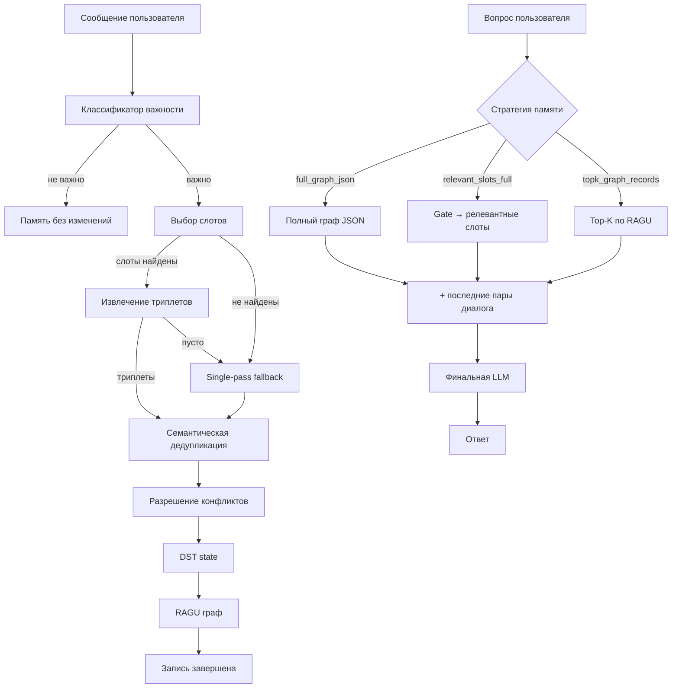
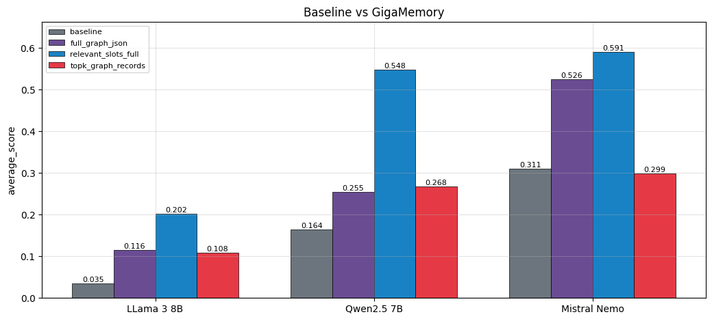

# GigaMemory

[](https://github.com/KadilenkoIvan/GigaMemory/actions/workflows/ci.yml)
[](https://www.python.org/downloads/)
[](LICENSE)

`DST_memory` — модуль долгосрочной памяти LLM на основе DST-графа фактов и RAGU retrieval.

## Quick Start

Два способа запуска: **Docker** и **из исходников** (uv).

### 🐳 Docker

**Требования:** Docker + Docker Compose; ключ [OpenRouter](https://openrouter.ai/); NVIDIA GPU + [nvidia-container-toolkit](https://docs.nvidia.com/datacenter/cloud-native/container-toolkit/latest/install-guide.html) — только для встроенного vLLM.

```bash
# 1. Клонировать и задать переменные окружения
git clone https://github.com/KadilenkoIvan/GigaMemory.git
cd GigaMemory
cp .env.example .env

# 2. Поднять всё одной командой
make docker-up-vllm     # vLLM (слот-модель) + REST API на :8000 — всё в Docker, нужен GPU
# make docker-up-all    # то же + Telegram-бот (полная демка)
# make docker-up-cpu    # без GPU: API в CPU-режиме (слот-модель — через внешний OpenRouter)
# make docker-up        # только API; свой vLLM снаружи (через SLOT_LLM_API_URL)
```

Swagger UI: `http://localhost:8000/docs` · здоровье: `http://localhost:8000/health` · остановить всё: `make docker-down`.
Подробности (профили, тома, переменные) — в разделе [Docker](#docker) ниже.

### ⚙️ Из исходников (uv)

**Требования:** GPU с CUDA, [uv](https://docs.astral.sh/uv/getting-started/installation/) и ключ [OpenRouter](https://openrouter.ai/).

```bash
# 1. Клонировать репозиторий
git clone https://github.com/KadilenkoIvan/GigaMemory.git
cd GigaMemory

# 2. Настроить окружение
make install          # всё: CUDA + API сервер + dev инструменты (рекомендуется)
# make install-local  # только для локального запуска пайплайна (без API)
# make install-api    # только для запуска API сервера (CUDA + fastapi/uvicorn)

# 3. Установить pre-commit хуки (один раз)
make hooks

# 4. Задать ключ OpenRouter
export OPENROUTER_API_KEY=sk-or-...   # Linux/Mac
$env:OPENROUTER_API_KEY="sk-or-..."  # Windows PowerShell

# 5а. Запустить интерактивный диалог (real-time режим)
uv run python DST_memory/run.py \
  --config DST_memory/run_config_local.json \
  pipeline inference interactive

# 5б. Запустить REST API сервер (с vLLM — рекомендуется)
# Terminal 1 (Linux/WSL): запустить vLLM inference server для слот-модели
make vllm   # vllm serve <AWQ-модель> --port 8001 --gpu-memory-utilization 0.65 ...

# Terminal 2 (Windows/Linux): запустить FastAPI
make serve  # или: OPENROUTER_API_KEY=sk-or-... make serve

# Или оба вместе (Linux/WSL):
make start
```

Конфиги: `DST_memory/run_config_local.json` — для интерактивного режима, `DST_memory/run_config_api.json` — для API сервера.

> **Модели произвольные.** И слот-модель (извлечение фактов), и финальная LLM не привязаны к конкретной модели: можно взять любую — локально (vLLM / HuggingFace) или удалённо через OpenRouter. Указанные ниже `Qwen3.5-4B-AWQ` (слот) и `gpt-4o-mini` (финальная) — лишь дефолтные примеры; меняются в конфиге без изменений в коде.  
> Слот-модель в примере (`Qwen3.5`, 4-bit AWQ / compressed-tensors) работает через **vLLM** — отдельный inference-сервер с PagedAttention и Flash Attention 2; 4B-модель умещается в ~4 GB VRAM.  
> vLLM не поддерживает Windows нативно — на Windows слот-сервер запускается в **WSL2** (модель видна по `/mnt/...`), а FastAPI на Windows ходит к нему по `localhost:8001`.  
> Финальная LLM — OpenRouter (`gpt-4o-mini` или любая другая модель через API).  
> Слот-модель и финальная LLM настраиваются независимо через `run_config_api.json` (`slot_model_path`, `slot_llm_mode: "local"|"vllm"`, `llm_model`, `llm_mode`).  
> Для быстрой проверки без GPU и LLM: `make smoke`.


## Что это за проект

- Память строится из сообщений пользователя в реальном времени.
- Из важных сообщений извлекаются триплеты `subject-relation-object` и записываются в DST-граф.
- Параллельный режим: ответ строится немедленно, запись в граф — в фоновом потоке.
- Для поддержания актуальности памяти: TTL (время жизни фактов), семантическая дедупликация, три режима удаления.
- При ответе формируется memory context одной из трёх стратегий и передаётся в финальную LLM.
- Продуктовый слой: REST API сервер с 6 endpoints, визуализация графа (PNG и интерактивный HTML).

## Что входит в каталог

- `run.py` — единая CLI-точка запуска (pipeline test / inference interactive / inference single-turn).
- `api.py` — FastAPI REST сервер (Этап 2); запускается через `make serve`.
- `dst_memory/` — вся логика пайплайна (разбита по подпакетам):
  - `core/` — pipeline, dst_manager, models, config, graph_backend
  - `prompts/` — сборщики промптов; тексты в `ru/` и `en/`; язык UI задаётся `prompt_language` в конфиге (включая тексты **финальной** LLM и real-time/parallel-write notices)
  - `slots/` — онтология, нормализация, slot_select_client, slot_update_client
  - `triplets/` — extraction, conflict, deletion, negation_detector
  - `storage/` — RAGU backend (ragu_graph_processor)
  - `clients/` — serving, classifier, memory_gate_client, llm_client
  - `utils/` — io_utils, dotenv_loader, run_config_loader
- `run_config.json` — runtime-конфиг по умолчанию (для валидации/тестов).
- `run_config_local.json` — конфиг для локального интерактивного режима.
- `run_config_api.json` — конфиг для REST API сервера.
- `CONFIG.md` — полное описание всех параметров конфига.
- `PIPELINE.md` — техническая документация по архитектуре, этапам и форматам данных.


## Docker

Контейнеризированный запуск — рекомендуемый способ для продакшена и для Windows (где vLLM требует WSL2, а API запускается в Docker).

### Требования

- [Docker Desktop](https://www.docker.com/products/docker-desktop/) (Windows/Mac) или Docker Engine + Compose plugin (Linux)
- NVIDIA GPU + [nvidia-container-toolkit](https://docs.nvidia.com/datacenter/cloud-native/container-toolkit/latest/install-guide.html) — только для режима `--profile vllm`

### Первый запуск

```bash
# 1. Скопировать шаблон переменных окружения
cp .env.example .env

# 2. Заполнить обязательные поля в .env:
#    OPENROUTER_API_KEY=sk-or-...
#    MODEL_DIR=D:/Users/me/GigaMemory/models   (если нужен встроенный vLLM)
```

### Режимы запуска

| Сценарий | Команда | Когда использовать |
|---|---|---|
| API + внешний vLLM | `docker compose up` | vLLM уже запущен (в WSL2 или на другой машине) |
| API + vLLM вместе | `docker compose --profile vllm up` | Хотите всё в Docker, GPU доступен |
| CPU-only (без GPU) | `TORCH_EXTRA=cpu docker compose up` | Тест без GPU; слот-модель через внешний OpenRouter |

```bash
# Makefile-обёртки:
make docker-up          # API only (bring your own vLLM)
make docker-up-vllm     # vLLM + API (требует GPU и MODEL_DIR)
make docker-up-cpu      # CPU-only API
make docker-down        # остановить всё
```

### Ключевые переменные .env

```dotenv
OPENROUTER_API_KEY=sk-or-...        # обязательно — финальная LLM
HF_TOKEN=hf_...                     # необязательно — для приватных моделей HF

# Порт, на котором API доступен снаружи (default 8000)
API_PORT=8000

# ── vLLM (только --profile vllm) ──────────────────────────────────────────
MODEL_DIR=./models              # путь к папке с моделями на хосте
MODEL_NAME=Qwen3.5-4B-AWQ      # имя подпапки внутри MODEL_DIR
VLLM_GPU_UTIL=0.65              # доля VRAM под KV-кеш
VLLM_MAX_LEN=8192               # максимальная длина контекста
VLLM_PORT=8001                  # порт vLLM на хосте

# ── Внешний vLLM (без --profile vllm) ─────────────────────────────────────
# Docker Desktop (Windows/Mac):
SLOT_LLM_API_URL=http://host.docker.internal:8001/v1
# Linux native Docker:
# SLOT_LLM_API_URL=http://172.17.0.1:8001/v1
```

### Как это работает

```
                    ┌─────────────────────────────────────┐
                    │  docker compose --profile vllm up   │
                    │                                     │
                    │  ┌─────────┐      ┌─────────────┐   │
 пользователь ────► │  │   api   │─────►│    vllm     │   │
  :8000             │  │  :8000  │      │  :8000 int  │   │
                    │  └─────────┘      └─────────────┘   │
                    │       │                  │          │
                    │  api_sessions       vllm_cache      │
                    │    (volume)          (volume)       │
                    └─────────────────────────────────────┘

 Без --profile vllm:  api → SLOT_LLM_API_URL (внешний сервер)
```

- **`api`** — GigaMemory FastAPI-сервер; всегда запускается; healthcheck на `/health`
- **`vllm`** — слот-модель (Qwen3.5-4B-AWQ по умолчанию); запускается только с `--profile vllm`; `api` ждёт его готовности через healthcheck перед стартом
- **`api_sessions`** (volume) — DST-граф, RAGU storage, состояния диалогов; переживает рестарт контейнера
- **`vllm_cache`** (volume) — KV-кеш vLLM; ускоряет холодный старт при перезапуске

### Пересборка после изменений кода

```bash
docker compose up --build                    # пересобрать api-образ
docker compose --profile vllm up --build     # пересобрать + запустить vllm
```

---

## Архитектура пайплайна




## REST API

FastAPI сервер с автоматической Swagger документацией.

### Запуск

```bash
# Установить зависимости (если ещё не сделано)
make install-api   # или make install

# Запустить сервер (порт 8000, hot-reload)
OPENROUTER_API_KEY=sk-or-... make serve

# Swagger UI: http://localhost:8000/docs
```

### Endpoints

| Метод | Путь | Описание |
|---|---|---|
| `POST` | `/dialogue/{id}/message` | Отправить сообщение, получить ответ LLM |
| `GET` | `/dialogue/{id}/graph` | Полный граф памяти (JSON со всеми метаданными) |
| `GET` | `/dialogue/{id}/graph_short` | Только активные триплеты + время истечения TTL |
| `GET` | `/dialogue/{id}/graph/image` | PNG-визуализация графа (networkx + matplotlib) |
| `GET` | `/dialogue/{id}/graph/html` | Интерактивный HTML-граф (pyvis, открывать в браузере) |
| `DELETE` | `/dialogue/{id}` | Сбросить память диалога |

Визуализация (`/graph/image` и `/graph/html`) повторяет логику отрисовки графа RAGU, но реализована автономно (без зависимости от пакета RAGU): узлы окрашены по слоту и масштабированы по числу связей, рёбра окрашены по TTL, есть легенды слотов и TTL. Сущности **scoped по слоту** — у каждого слота своя копия узлов (включая «пользователь»), поэтому слоты рисуются раздельными непересекающимися кластерами.

### Примеры запросов (Windows PowerShell)

```powershell
# Отправить сообщение
Invoke-RestMethod -Method POST `
  -Uri "http://localhost:8000/dialogue/user1/message" `
  -ContentType "application/json" `
  -Body '{"content": "Привет, я Ваня, работаю в Экспасофт"}'

# Краткий граф памяти
Invoke-RestMethod "http://localhost:8000/dialogue/user1/graph_short"

# Открыть интерактивный HTML-граф в браузере
Start-Process "http://localhost:8000/dialogue/user1/graph/html"

# Скачать PNG граф
Invoke-WebRequest "http://localhost:8000/dialogue/user1/graph/image" -OutFile graph.png

# Сбросить память
Invoke-RestMethod -Method DELETE "http://localhost:8000/dialogue/user1"
```

### Параллельная запись в API

```powershell
# Запись в память идёт в фоне, ответ возвращается немедленно
Invoke-RestMethod -Method POST `
  -Uri "http://localhost:8000/dialogue/user1/message" `
  -ContentType "application/json" `
  -Body '{"content": "Я купил новую машину", "parallel_write": true}'
```

### Конфиг API

`DST_memory/run_config_api.json` — отдельный конфиг для API режима.  
Ключ OpenRouter берётся из переменной `OPENROUTER_API_KEY` (или прописывается в конфиге).  
Конфиг переопределяется через env-переменную `GIGAMEMORY_CONFIG`.

---

## Telegram-бот

Демонстрационный бот — **тонкий HTTP-клиент** поверх REST API (`telegram_bot/`). Вся логика памяти остаётся на сервере; бот только пересылает запросы. У каждого пользователя Telegram — **свой граф памяти** (`dialogue_id` = id пользователя).

### Возможности

- Свободный диалог: сообщение → ответ с учётом памяти; индикатор «печатает…» во время генерации.
- Выбор языка ответов при первом `/start` (ru/en) — интерфейс бота остаётся русским, меняется только язык, на котором отвечает ассистент (через `prompt_language` в `/message`).
- Каждый пользователь изолирован — графы не смешиваются.

### Команды

| Команда | Описание |
|---|---|
| `/start` | Приветствие, краткое объяснение; при первом запуске — выбор языка ответов |
| `/info` | Подробно: что это за демонстрация и как работает система |
| `/graph` | Текущий граф знаний картинкой (PNG) |
| `/graph_html` | Интерактивный граф файлом `.html` (открыть в браузере) |
| `/memory` | Активные слоты и факты в человекочитаемом виде |
| `/forget` | Сбросить память текущего пользователя |
| `/stats` | Количество слотов, фактов (триплетов) и сущностей |
| `/language` | Сменить язык ответов ассистента |

### Запуск

```bash
# 1. Создать бота через @BotFather (/newbot) и получить токен
# 2. Прописать в .env (корень репозитория):
#    TELEGRAM_BOT_TOKEN=8123456789:AAH...
#    GIGAMEMORY_API_URL=http://localhost:8000   # где слушает FastAPI

# 3a. Локально (нужен запущенный API):
make install-bot     # поставить зависимости бота (без torch/GPU)
make bot             # запустить бота (long polling)

# 3b. Через Docker (поднимает API + бота):
make docker-up-bot
#  Полная демка (vLLM + API + бот):
make docker-up-all
```

> Бот не требует GPU/torch — это лёгкий HTTP-клиент (`python-telegram-bot` + `httpx`). Образ `Dockerfile.bot` собирается за секунды. Внутри Docker-сети бот ходит к API по `http://api:8000`. Выбранный язык каждого пользователя сохраняется между перезапусками (volume `bot_state`).

---

## Режимы запуска (CLI)

### Test

Batch-прогон jsonl: сообщения проходят запись в память, затем вызывается ответ на финальный вопрос.

```bash
uv run python DST_memory/run.py pipeline test --dataset-path tests/fixtures/format_example.jsonl --output-path DST_memory/output.json
```

### Inference Interactive

Real-time диалог: новое сообщение → запись в память → ответ LLM. Каждая сессия изолирована по datetime.

```bash
uv run python DST_memory/run.py \
  --config DST_memory/run_config_local.json \
  pipeline inference interactive

# С параллельной записью (ответ не ждёт записи в память)
uv run python DST_memory/run.py \
  --config DST_memory/run_config_local.json \
  pipeline inference interactive --parallel-write
```

### Inference Single-turn

Один запрос на вход, один ответ на выход.

```bash
uv run python DST_memory/run.py pipeline inference single-turn --dialogue-id d1 --message "..."
```

## Стратегии памяти

Переключаются `--memory-strategy`:

- `full_graph_json` — полный активный граф памяти в JSON.
- `relevant_slots_full` — LLM-gate выбирает слоты, передается полное содержимое выбранных слотов.
- `topk_graph_records` — top-k наиболее релевантных записей по всему графу (RAGU search).

## Важные флаги

**Память и стратегия:**
- `--memory-strategy` (`full_graph_json` | `relevant_slots_full` | `topk_graph_records`)
- `--graph-top-k-records` — top-k для стратегии `topk_graph_records`
- `--recent-history-pairs` — размер окна последних пар user/assistant

**Модели:**
- `--slot-model-path` — путь/id к Qwen-модели для слотов/триплетов (локальной или запущенной в vLLM)
- `--slot-llm-load-quantization` (`none`|`8bit`|`4bit`) — BitsAndBytes для slot/triplet модели (только `slot_llm_mode=local`); в JSON: `shared.slot_llm_load_quantization`
- `--importance-model-path` — путь к BERT-классификатору важности (пусто = stub, важность всегда True)
- `--ragu-embedder-model` — модель эмбеддингов для RAGU

**vLLM-режим (JSON config only — нет CLI-флагов):**
- `shared.slot_llm_mode` — `"local"` (HF transformers in-process) или `"vllm"` (внешний vLLM-сервер)
- `shared.slot_llm_api_url` — URL vLLM-сервера, по умолчанию `"http://localhost:8001/v1"`
- `shared.slot_llm_api_key` — API-ключ vLLM (default `"EMPTY"`)

**Бюджеты токенов slot-модели (JSON config only):**
- `shared.slot_select_max_tokens` (220), `shared.triplet_extract_max_tokens` (512), `shared.conflict_max_tokens` (256), `shared.deletion_max_tokens` (256), `shared.memory_gate_max_tokens` (200) — `max_new_tokens` для каждого вызова slot-модели (см. CONFIG.md)

**Память / memory gate (JSON config only):**
- `shared.relevant_slots_always_include_identity` — в режиме `relevant_slots_full` всегда передавать слот `IDENTITY` в финальную LLM (обход недобора у маленьких моделей)

**Хранение и сессии:**
- `--ragu-storage-path` — путь к RAGU storage
- `--session-dir` — директория сессий; каждый запуск создаёт `<session_dir>/<dialogue_id>_<datetime>/`
- `--dialogue-id` — базовый id диалога (суффикс datetime добавляется автоматически)

**Финальная LLM:**
- `--llm-mode` (`openrouter` | `api` | `puter` | `stub` | `local`)
- `--llm-model` — model id провайдера (напр. `openai/gpt-4o-mini`)
- `--no-final-llm` — вернуть только структуру без вызова final LLM

**Интерактивный режим:**
- `--parallel-write` (флаг после `pipeline inference interactive`) — параллельная запись в граф; ответ строится немедленно, граф обновляется в фоне

**Язык и конфликты:**
- `--prompt-language` (`ru` | `en`) — язык промптов для всего стека включая финальную LLM
- `--no-conflict-rule-same-relation-updates` — отключить детерминированную замену (только через LLM-конфликт)

Для ограничения входного контекста final LLM: `shared.llm_max_context_tokens` в конфиге (0 = без ограничения). Важно для моделей с окном 32K.

## Режимы удаления фактов

Управляются двумя флагами `--slot-context-enabled` и `--triplet-deletion-mode`.

| Вариант | Флаги | Описание |
|---|---|---|
| A (inline) | `--slot-context-enabled --triplet-deletion-mode llm_inline` | Один LLM-вызов: модель видит текущие факты и выдаёт `delete`-сигналы вместе с новыми триплетами |
| B (separate) | `--triplet-deletion-mode llm_separate` | Отдельный LLM-вызов для детекции удалений, extraction без контекста |
| C (heuristic) | `--triplet-deletion-mode heuristic` | Rule-based паттерны отрицания без LLM, опционально `--deletion-use-pymorphy` |

Подробно — в `CONFIG.md`.

## Ключевые ограничения

- `llm_mode=local` для final LLM поддерживается, но требует достаточного VRAM/CPU RAM и корректной локальной HF-модели.
- `llm_inline` режим автоматически включает контекст слота, даже если `slot_context_enabled=false`.
- Heuristic-детектор покрывает явные паттерны отрицания; косвенные семантические удаления — через LLM-режимы.

## Валидация

> 📊 **Полная методика, все таблицы и графики — в [validation/README.md](validation/README.md).**

### Результаты (кратко)

Сравнение на **LongMemEval**: одна и та же финальная LLM отвечает либо по «сырому» диалогу (baseline full-context), либо по структурированной памяти GigaMemory. Метрика — средний балл LLM-судьи (0–1).

| Финальная LLM | Baseline (full-context) | GigaMemory (`relevant_slots_full`) | Прирост |
|---------------|:---:|:---:|:---:|
| LLaMA-3-8B   | 0.035 | **0.203** | ×5.8 |
| Qwen2.5-7B   | 0.164 | **0.548** | ×3.3 |
| Mistral-Nemo | 0.311 | **0.620** | ×2.0 |



**Главное:**
- Структурированная память превосходит подачу полного диалога для всех трёх финальных LLM.
- Выигрыш тем больше, чем хуже модель держит длинный контекст.
- Лучшая стратегия памяти — `relevant_slots_full` (подавать только релевантные вопросу слоты).

Подробные таблицы по типам вопросов, стратегиям, вариантам графа и Memory Hit Rate — в [validation/README.md](validation/README.md).

### LongMemEval Benchmark

Для тестирования качества системы памяти используется датасет **LongMemEval** (`xiaowu0162/longmemeval-cleaned`).

### Структура валидации

```
validation/
├── README.md               # 👉 Методика + результаты (точка входа)
├── GigaMemory_full/        # Полное тестирование GigaMemory 
│   ├── validate_longmemeval.py      # Основной скрипт с 4 режимами
│   ├── config_*.json                # Конфиги стадий (memory_only / final_llm_only / judge_only)
│   ├── results_judge_bundle_*/      # Итоговые validation_results.json по стратегиям
│   └── README.md, CONFIG.md, README_CONFIG.md
├── baseline/               # Baseline тестирование (full-context)
│   ├── validate_baseline.py
│   ├── run_config_full_context_*.json
│   └── baseline_tests/              # validation_results.json по моделям
└── metrics/                # Сводные выжимки: metrics-baseline.json, metrics-gigamemory.json
```

> Сырые прогоны (векторные БД, DST-снапшоты, промежуточные ответы) весят гигабайты и в репозиторий не коммитятся — см. секцию «Что лежит в репозитории» в [validation/README.md](validation/README.md).

### Режимы валидации 

Скрипт `validate_longmemeval.py` поддерживает 4 режима работы:

| Режим | Описание | Команда |
|-------|----------|---------|
| `full` | Полный пайплайн: память → финальная LLM → судья | `python validate_longmemeval.py --validation-mode full` |
| `memory_only` | Только обработка памяти и сохранение переиспользуемого state | `python validate_longmemeval.py --validation-mode memory_only --memory-only-write-mode standard` |
| `final_llm_only` | Загрузка сохранённой памяти → генерация ответов для 1+ стратегий | `python validate_longmemeval.py --validation-mode final_llm_only --input-state-dir ./results_memory --final-llm-memory-strategies full_graph_json,relevant_slots_full,topk_graph_records` |
| `judge_only` | Оценка сохранённых ответов с Memory Hit Rate | `python validate_longmemeval.py --validation-mode judge_only --input-answers-path ./results/answers.json` |

### 1. GigaMemory Full Validation

#### Полный пайплайн (режим `full`)

Полное тестирование с structured memory, batch processing и Memory Hit Rate.

```bash
cd validation/GigaMemory_full

# Используем конфиг файл (config_full.json)
python validate_longmemeval.py --config ./config_full.json

# Или с кастомным конфигом
python validate_longmemeval.py --config ./my_config.json

# Batch processing: накапливаем 5 диалогов перед вызовом финальной LLM
python validate_longmemeval.py \
    --validation-mode full \
    --val-shared-num-items-per-type 20 \
    --val-batch-final-llm-batch-size 5 \
    --val-batch-judge-batch-size 10

# С подсчётом Memory Hit Rate (дополнительная метрика)
python validate_longmemeval.py \
    --validation-mode full \
    --calculate-memory-hit-rate \
    --judge-mode openrouter
```

#### Пошаговая валидация (3 этапа)

Разделение процесса для экономии ресурсов и тестирования разных конфигураций:

```bash
# Шаг 1: Обработка памяти (один раз)
python validate_longmemeval.py \
    --validation-mode memory_only \
    --memory-only-write-mode single_path_only \
    --config ./config_memory_only.json

# Шаг 2: Генерация ответов (можно запускать с разными LLM и стратегиями памяти)
python validate_longmemeval.py \
    --validation-mode final_llm_only \
    --input-state-dir ./results_memory_only \
    --final-llm-memory-strategies full_graph_json,relevant_slots_full,topk_graph_records \
    --final-llm-memory-payload-mode triplets_only \
    --gm-llm-model "openai/gpt-4o-mini" \
    --config ./config_final_llm.json

# Шаг 3: Оценка (можно менять judge модель)
python validate_longmemeval.py \
    --validation-mode judge_only \
    --input-answers-path ./results_final_llm/intermediate_answers.json \
    --calculate-memory-hit-rate \
    --config ./config_judge.json
```

**Преимущества разделения:**
- Обработка памяти выполняется один раз (самый быстрый этап)
- Можно тестировать разные финальные LLM на одних и тех же состояниях памяти
- GPU оптимизация: выгрузка моделей памяти перед загрузкой большой LLM
- Гибкость в выборе моделей для каждого этапа

**Метрики:**
- Accuracy (correct / total)
- Memory Hit Rate (дополнительно, через `--calculate-memory-hit-rate`)

### 2. Baseline Validation

Сравнение с простыми стратегиями передачи контекста.

```bash
cd validation/baseline

# Baseline: передаём ВЕСЬ контекст (все user + assistant)
python validate_baseline.py --strategy full_context

# Baseline: последние 10 пар + оставшиеся user сообщения
python validate_baseline.py --strategy recent_10_plus_user --output-dir ./results_recent10
```

**Стратегии:**
- `full_context` — все user и assistant сообщения из всех сессий
- `recent_10_plus_user` — последние 10 пар + все ранние user сообщения

**Метрики:**
- Accuracy (correct / total)

### Честное сравнение

Для честного сравнения используйте **одинаковые** настройки:

```bash
# 1. GigaMemory
cd validation/GigaMemory_full
python validate_longmemeval.py --config ./run_config.json

# 2. Baseline - Full Context
cd validation/baseline
python validate_baseline.py \
    --strategy full_context \
    --config ./run_config.json

# 3. Baseline - Recent 10 + User
python validate_baseline.py \
    --strategy recent_10_plus_user \
    --config ./run_config.json
```

### Структура вывода (GigaMemory)

```
output-dir/
├── validation_results.json     # Итоговые метрики
│   {
│     "statistics": {
│       "total": 50,
│       "correct": 42,
│       "incorrect": 8,
│       "accuracy": 0.84,
│       "memory_hit": 48,       # GigaMemory only
│       "memory_miss": 2,       # GigaMemory only
│       "memory_hit_rate": 0.96 # GigaMemory only
│     },
│     "results": [...]
│   }
├── validation.log              # Полный лог
└── chunk_*/                    # Состояние памяти (GigaMemory only)
```

Подробная документация:
- GigaMemory: `validation/GigaMemory_full/README.md`, `README_CONFIG.md`
- Baseline: `validation/baseline/README.md`

## Подробная техдокументация

См. `PIPELINE.md` — полный разбор всех этапов, связей между модулями, форматов данных и поведения в разных сценариях.
